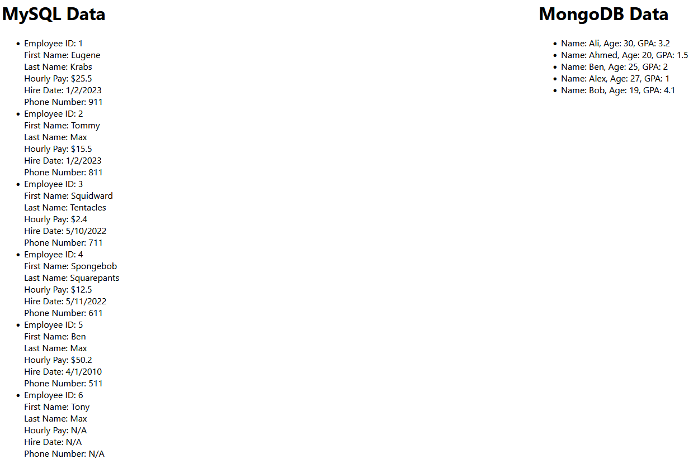

<h2 align="center">
  Back-End Project 
</h2>
 

## TL;DR

You can fork this repo to modify and make changes of your own. Please give me proper credit. Thanks!

## Built With

Back-End Project which Shows Data from DataBase of Both MySQL and MongoDB and show it on Front-End Using Node.js and Express.js. 

This project was built using these technologies.

- React.js
- Node.js
- Express.js
- MySQL
- MongoDB
- CSS
- JS/JSX
- VsCode

## Features

  📦 Used to Show Data from DB to Front-End

## Getting Started

Clone down this repository. You will need `node.js` and `git` installed globally on your machine.

## 🛠 Installation and Setup Instructions

1. Installation: `npm install`

2. In the project directory, you can run: `npm start`

Runs the app in the development mode.\
Open [http://localhost:3000](http://localhost:3000) to view it in the browser.
The page will reload if you make edits.

## Usage Instructions

Open the project folder and Navigate to `/src/components/`.  
You will find all the components used and you can edit your information accordingly.

### Show your support

Give a ⭐ if you like this website!
